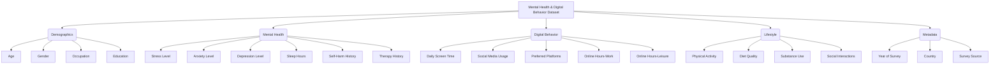

```mermaid
graph TD
  MHDB[Mental Health & Digital Behavior Dataset]
  
  MHDB --> D(Demographics)
  MHDB --> MH(Mental Health)
  MHDB --> DB(Digital Behavior)
  MHDB --> LS(Lifestyle)
  MHDB --> MD(Metadata)

  D --> Age
  D --> Gender
  D --> Occupation
  D --> Education

  MH --> Stress[Stress Level]
  MH --> Anxiety[Anxiety Level]
  MH --> Depression[Depression Level]
  MH --> Sleep[Sleep Hours]
  MH --> SelfHarm[Self-Harm History]
  MH --> Therapy[Therapy History]

  DB --> ScreenTime[Daily Screen Time]
  DB --> SocialMedia[Social Media Usage]
  DB --> Platforms[Preferred Platforms]
  DB --> OnlineWork[Online Hours-Work]
  DB --> OnlineLeisure[Online Hours-Leisure]

  LS --> Activity[Physical Activity]
  LS --> Diet[Diet Quality]
  LS --> Substance[Substance Use]
  LS --> Social[Social Interactions]

  MD --> Year[Year of Survey]
  MD --> Country
  MD --> Source[Survey Source]
```

