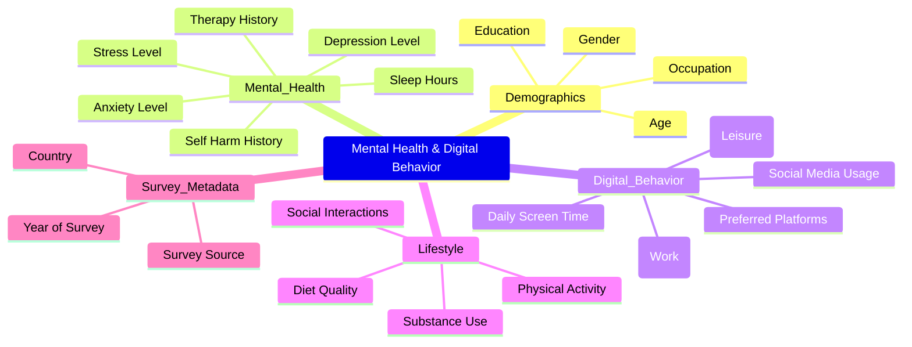

```mermaid
mindmap
Mental Health & Digital Behavior
    Demographics
      Age
      Gender
      Occupation
      Education
    Mental_Health
      Stress Level
      Anxiety Level
      Depression Level
      Sleep Hours
      Self Harm History
      Therapy History
    Digital_Behavior
      Daily Screen Time
      Social Media Usage
      Preferred Platforms
      Online Hours (Work)
      Online Hours (Leisure)
    Lifestyle
      Physical Activity
      Diet Quality
      Substance Use
      Social Interactions
    Survey_Metadata
      Year of Survey
      Country
      Survey Source
```

